# NCSHelper

## Table of Content

- About this website
- Screenshots of functions demonstration
- Technological structure
- Setup environment
- Credits

## About this website

NCSHelper is a prototype that serves the purpose to investigate a solution platform to alleviate student learning struggles in the MSc in Computer Science program in Newcastle University


## Screenshots of functions demonstration

### Navigation Bar


### Register and Login Section

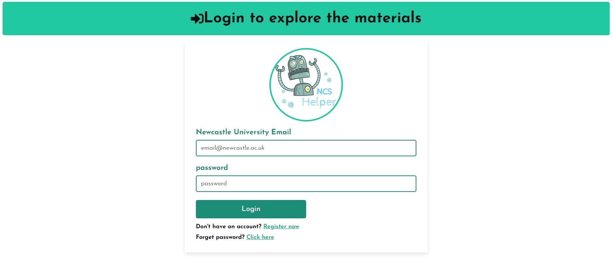
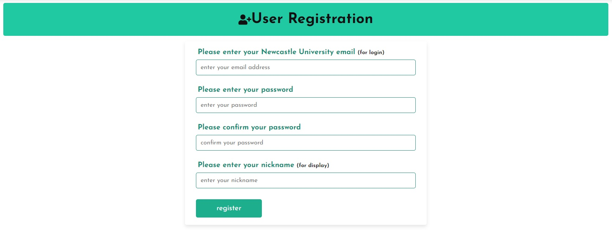

### User Profile

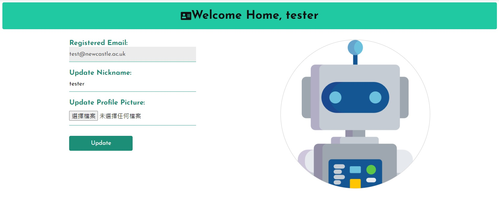

### Dashboard


### Course section

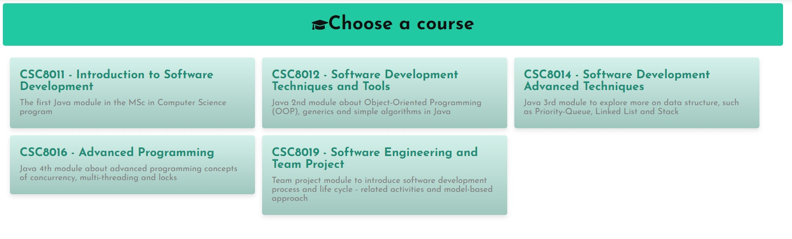
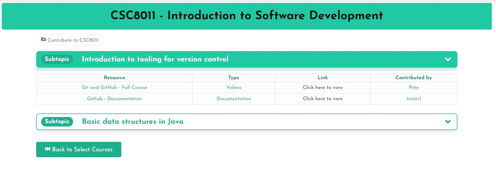
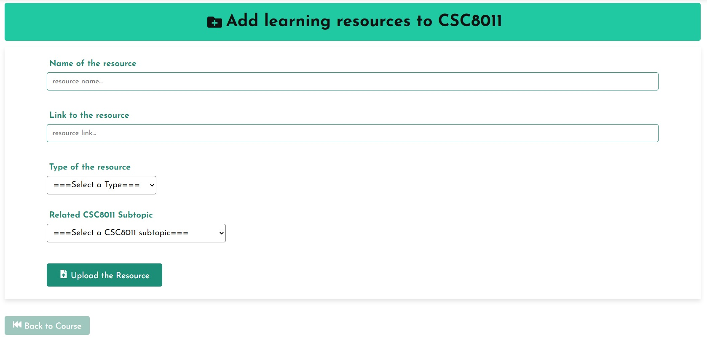

### Guide section

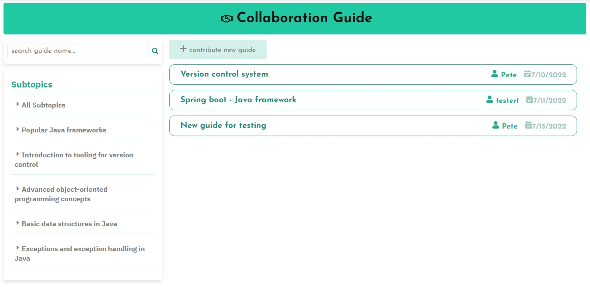
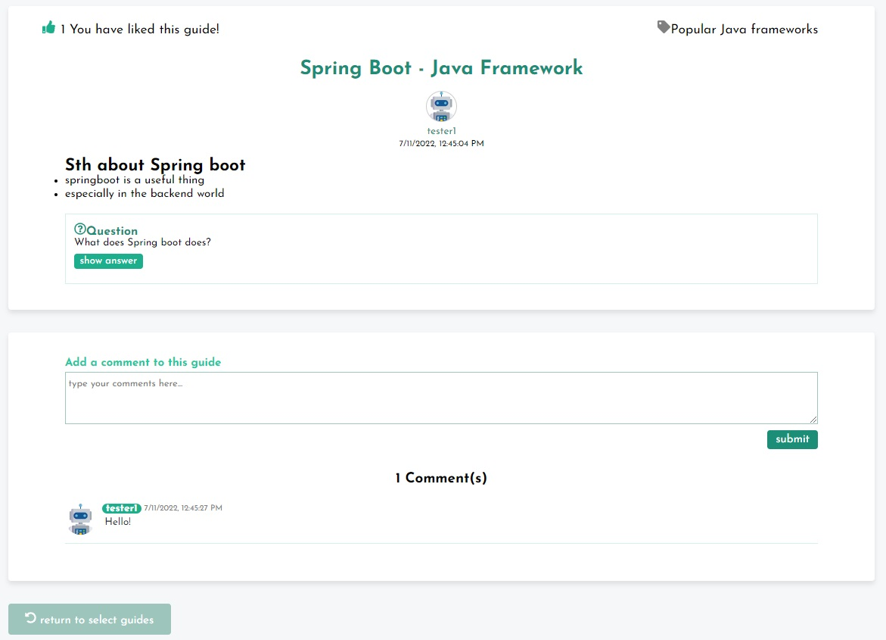
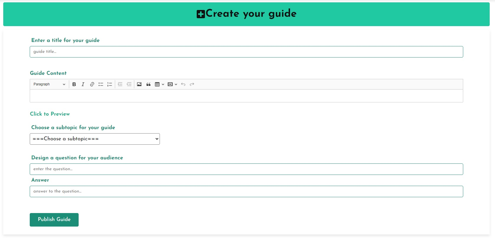
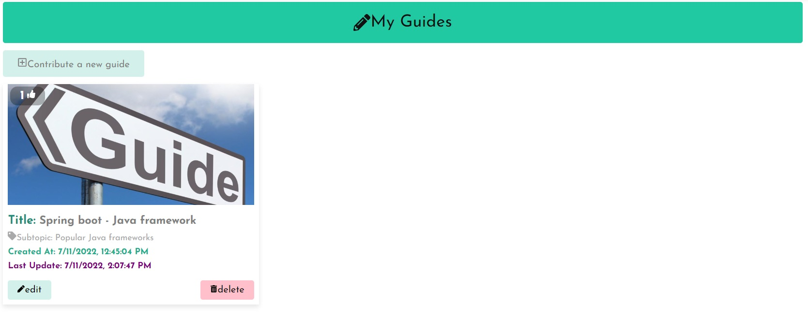

### Blog section

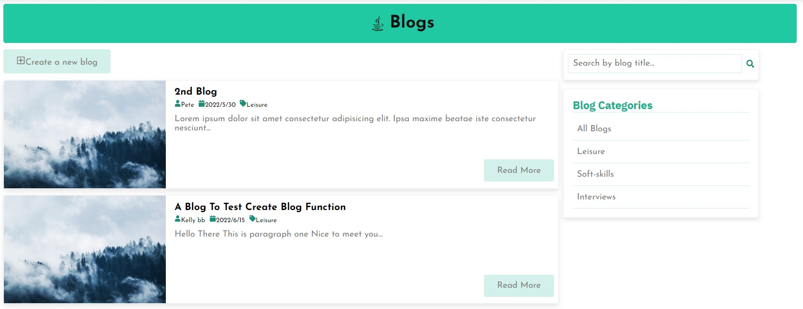
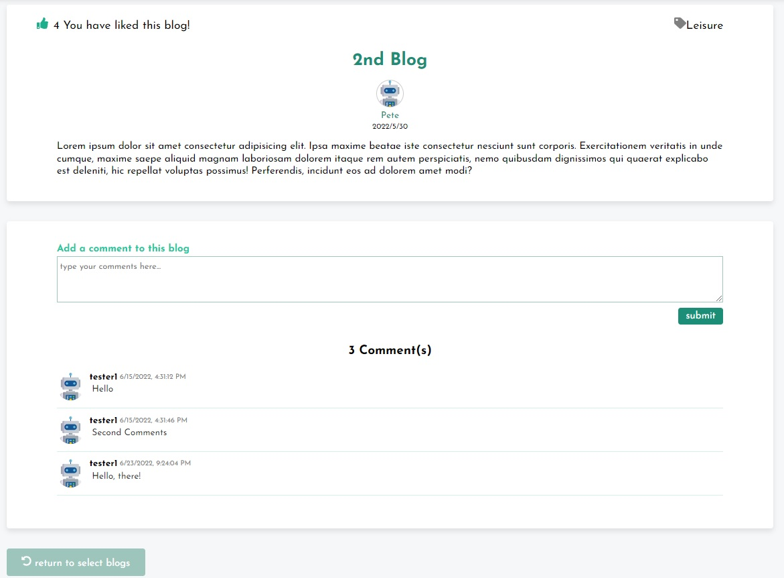
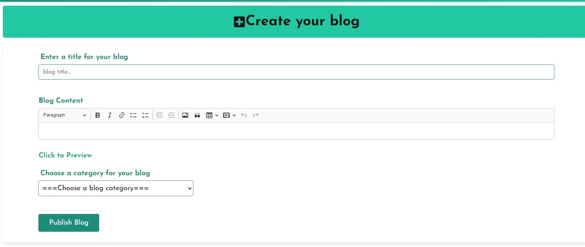
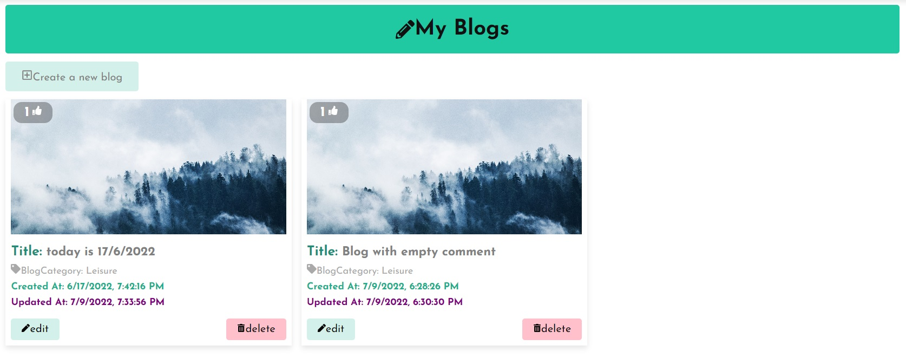

## Technological structure (Stack)

- Frontend: React.js, HTML, CSS, SCSS
- Backend: Express.js, Node.js
- Database: MongoDB
  

## Setup Environment

- Download and clone the repository
- Make sure you have your devices installed with node runtime environment

### Backend setup

- Navigate to the backend folder
- Run the command "npm install" to make sure you have all the necessary backend node packages installed

```bash
cd backend
npm install
```

### Frontend setup

- Navigate to the frontend folder
- Run the command "npm install" to make sure you have all the necessary frontend node packages installed

```bash
cd frontend
npm install
```

After all the packages are installed, run the "npm start" command in the frontend directory

```bash
npm start
```

## Credits

Created By Pete, To Chun Yip | All Rights Reserved
